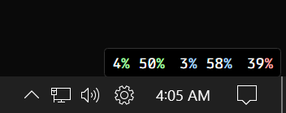

# Mini System Monitor

A minimal, always-on-top system monitoring widget for Windows.

## Stats

| Stat | Description |
|------|-------------|
| **CPU Load** | Current CPU utilization (0-100%) |
| **CPU Temp** | CPU temperature as % of 100°C max |
| **GPU Load** | Current GPU utilization (0-100%) |
| **GPU Temp** | GPU temperature as % of 83°C max |
| **RAM** | Memory usage (0-100%) |

## Requirements

- Windows
- [LibreHardwareMonitor](https://github.com/LibreHardwareMonitor/LibreHardwareMonitor) with web server enabled on port 8085

## Usage

1. Start LibreHardwareMonitor with `Options > Web Server > Run`
2. Run `Mini System Monitor.exe`
3. Drag to reposition, right-click for options
